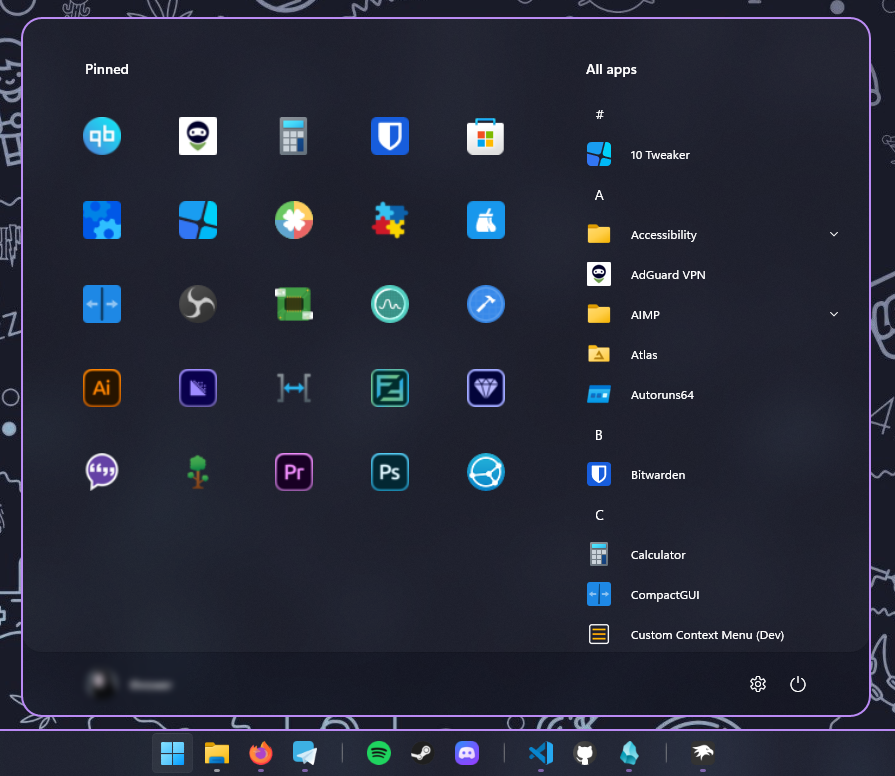
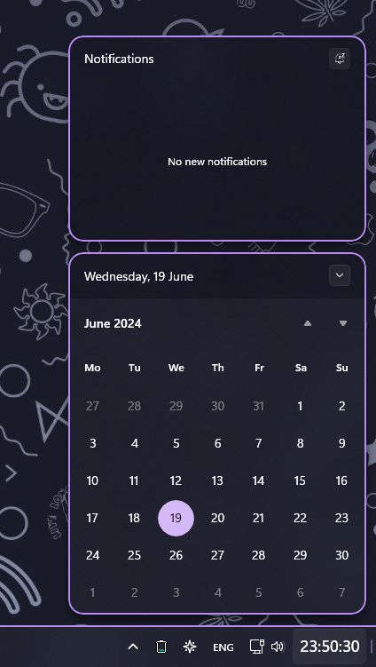
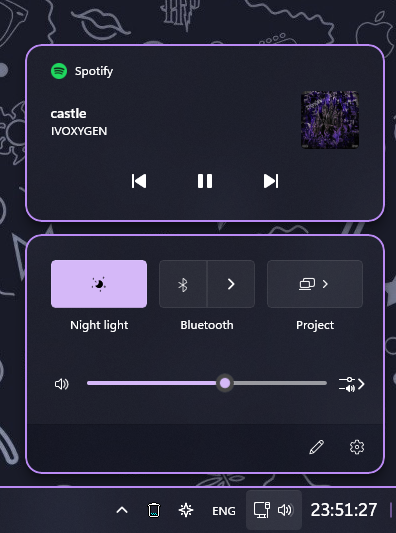
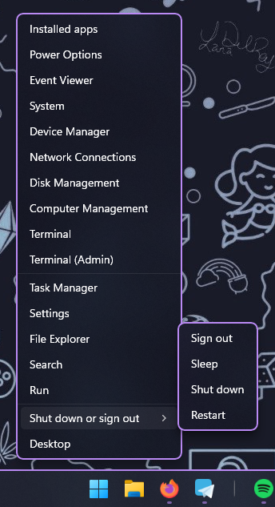
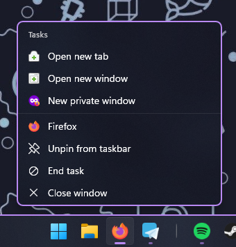
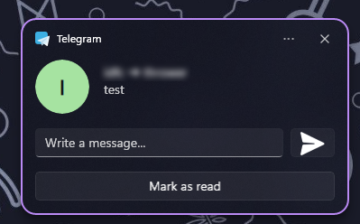
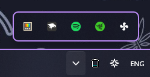

 

other images

 

## Windows 11 Start Menu Styler

<b>Start area </b>

- <b>Background color</b>
	- Target `Border#AcrylicBorder`

		`Background:=<AcrylicBrush TintColor="#11111b" TintOpacity="0.2" TintLuminosityOpacity="0.7"/>`
- <b>Corner radius</b>
	- Target `Border#AcrylicBorder`

		`CornerRadius=20`
- <b>Border thickness</b>
	- Target `Border#AcrylicBorder`
		
		`BorderThickness=2,2,2,2`
- <b>Border color</b>
	- Target `Border#AcrylicBorder`
	
		`BorderBrush:=<SolidColorBrush Color="{ThemeResource SystemAccentColor}"/>`
- <b>Shadow round corners</b>
	- Target `Border#DropShadow`

		`CornerRadius=20`
- <b>Hide shadow</b>
	- Target `Border#DropShadow`

		`Visibility=Collapsed`
- <b>Controls and "Pinned apps" hover corner radius</b>
	- Target `Windows.UI.Xaml.Controls.Border#BackgroundBorder`

		`CornerRadius=12`
- <b>Increase height "Pinned apps" area (overlap suggestions)</b>
	- Target `StartMenu.PinnedList#StartMenuPinnedList`

		`Height=510`

<b>Apps area</b>

- <b>Background round corners</b>
	- Target `Border#AcrylicOverlay`

		`CornerRadius=20`
- <b>"All apps" hover round corners</b>
	- Target `Windows.UI.Xaml.Controls.Border#Border`

		`CornerRadius=12`
	- Target `Windows.UI.Xaml.Controls.Border#BorderBackground`

		`CornerRadius=12`
- <b>Hide recommendations</b>
	- Target `Windows.UI.Xaml.Controls.Grid#ShowMoreSuggestions`

		`Visibility=Collapsed`
	- Target `Windows.UI.Xaml.Controls.Grid#SuggestionsParentContainer`

		`Visibility=Collapsed`
	- Target `Windows.UI.Xaml.Controls.Grid#TopLevelSuggestionsListHeader`

		`Visibility=Collapsed`
- <b>Hide searchbar</b>
	- Target `StartDocked.SearchBoxToggleButton`
	
		`Height=0`

		`Margin=0,0,0,0`
- <b>Hide "Pinned apps" labels</b>
	- Target `Windows.UI.Xaml.Controls.TextBlock#DisplayName`

		`Visibility=Collapsed`
- <b>Reduce "Pinned apps" hover size</b>
	- Target `Windows.UI.Xaml.Controls.Grid#DroppedFlickerWorkaroundWrapper > Border#BackgroundBorder`

		`Height=70`

		`Width=70`
- <b>Increase "Pinned apps" icons size</b>
	- Target `Windows.UI.Xaml.Controls.Image#Logo` icon size

		`Width=38`

		`Height=38`
	- Target `Windows.UI.Xaml.Controls.Grid#LogoContainer` increase icon container size

		`Height=60`

		`Width=60`
	- Target `Microsoft.UI.Xaml.Controls.ItemsRepeater#LogosRepeater > Windows.UI.Xaml.Controls.Grid` scale folders

		`Width=22`

		`Height=22`
	- Target `Microsoft.UI.Xaml.Controls.ItemsRepeater#LogosRepeater` scale folders

		`Width=49`

		`Height=49`
	- Target `Windows.UI.Xaml.Controls.Border#FolderPlate` scale folders

		`Height=56`

		`Width=56`
	- Target `Windows.UI.Xaml.Controls.Grid#LogosContainer` scale folders

		`Height=68`

		`Width=68`
- <b>Hide "Pinned apps" page indicator</b>
	- Target `Microsoft.UI.Xaml.Controls.PipsPager#PinnedListPipsPager`

		`Visibility=Collapsed`
- <b>Center page indicator between "Pinned apps" and "All apps"</b>
	- Target `Microsoft.UI.Xaml.Controls.PipsPager#PinnedListPipsPager`

		`Transform3D:=<CompositeTransform3D TranslateX="-15"/>`
- <b>Always show "All apps" menu</b>
	- Target `Windows.UI.Xaml.Controls.Grid#UndockedRoot`

		`Margin=0,0,290,0`
	- Target `Windows.UI.Xaml.Controls.Grid#AllAppsRoot` always show "All apps" menu

		`Visibility=Visible`

		`Width=380`

		`Transform3D:=<CompositeTransform3D TranslateX="-565"/>`
	- Target `Windows.UI.Xaml.Controls.Primitives.ScrollBar#VerticalScrollBar` view "All apps" menu scrollbar

		`Transform3D:=<CompositeTransform3D TranslateX="-35"/>`
	- Target `Windows.UI.Xaml.Controls.Button#CloseAllAppsButton`  hide "Back" button in "All apps" menu

		`Visibility=Collapsed`
	- Target `Windows.UI.Xaml.Controls.Button#ShowAllAppsButton`  hide "All apps" button in "Pinned apps" area

		`Visibility=Collapsed`
	- Target `StartDocked.StartSizingFrame` set start menu size
	
		`MinWidth=850`
	
		`MaxWidth=850`
	
		`MaxHeight=700`

<b>Folder</b>

- <b>Background color</b>
	- Target `Windows.UI.Xaml.Controls.Grid#Root > Border`

		`Background:=<AcrylicBrush TintColor="#11111b" TintOpacity="0.4" TintLuminosityOpacity="0.4"/>`
- <b>Round corners</b>
	- Target `Windows.UI.Xaml.Controls.Grid#Root > Border`

		`CornerRadius=20`
- <b>Border thickness</b>
	- Target `Windows.UI.Xaml.Controls.Grid#Root > Border`

		`BorderThickness=2,2,2,2`
- <b>Border color</b>
	- Target `Windows.UI.Xaml.Controls.Grid#Root > Border`

		`BorderBrush:=<SolidColorBrush Color="{ThemeResource SystemAccentColor}"/>`

## Windows 11 Notification Center Styler

<b>Notification center</b>

- <b>Background color</b>
	- Target `Windows.UI.Xaml.Controls.Grid#NotificationCenterGrid`

		`Background:=<AcrylicBrush TintColor="#11111b" TintOpacity="0.2" TintLuminosityOpacity="0.7"/>`
- <b>Round corners</b>
	- Target `Windows.UI.Xaml.Controls.Grid#NotificationCenterGrid`

		`CornerRadius=16`
- <b>Border thickness</b>
	- Target `Windows.UI.Xaml.Controls.Grid#NotificationCenterGrid`

		`BorderThickness=2,2,2,2`
- <b>Border color</b>
	- Target `Windows.UI.Xaml.Controls.Grid#NotificationCenterGrid`

		`BorderBrush:=<SolidColorBrush Color="{ThemeResource SystemAccentColor}"/>`

<b>Calendar</b>

- <b>Hide "Focus session"</b>
	- Target `ActionCenter.FocusSessionControl`
    
		`Visibility=Collapsed`
- <b>Background color</b>
	- Target `Windows.UI.Xaml.Controls.Grid#CalendarCenterGrid`
    
		`Background:=<AcrylicBrush TintColor="#11111b" TintOpacity="0.2" TintLuminosityOpacity="0.7"/>`
- <b>Round corners</b>
	- Target `Windows.UI.Xaml.Controls.Grid#CalendarCenterGrid`
    
		`CornerRadius=16`
- <b>Border thickness</b>
	- Target `Windows.UI.Xaml.Controls.Grid#CalendarCenterGrid`
    
		`BorderThickness=2,2,2,2`
- <b>Border color</b>
	- Target `Windows.UI.Xaml.Controls.Grid#CalendarCenterGrid`
    
		`BorderBrush:=<SolidColorBrush Color="{ThemeResource SystemAccentColor}"/>`

<b>Media control center</b>

- <b>Background color</b>
	- Target `Windows.UI.Xaml.Controls.Grid#MediaTransportControlsRegion`
    
		`Background:=<AcrylicBrush TintColor="#11111b" TintOpacity="0.2" TintLuminosityOpacity="0.7"/>`
- <b>Round corners</b>
	- Target `Windows.UI.Xaml.Controls.Grid#MediaTransportControlsRegion`
    
		`CornerRadius=16`
- <b>Border thickness</b>
	- Target `Windows.UI.Xaml.Controls.Grid#MediaTransportControlsRegion`
    
		`BorderThickness=2,2,2,2`
- <b>Border color</b>
	- Target `Windows.UI.Xaml.Controls.Grid#MediaTransportControlsRegion`
    
		`BorderBrush:=<SolidColorBrush Color="{ThemeResource SystemAccentColor}"/>`

<b>Control center</b>

- <b>Background color</b>
	- Target `Windows.UI.Xaml.Controls.Grid#ControlCenterRegion`
    
		`Background:=<AcrylicBrush TintColor="#11111b" TintOpacity="0.2" TintLuminosityOpacity="0.7"/>`
- <b>Round corners</b>
	- Target `Windows.UI.Xaml.Controls.Grid#ControlCenterRegion`
    
		`CornerRadius=16`
- <b>Border thickness</b>
	- Target `Windows.UI.Xaml.Controls.Grid#ControlCenterRegion`
    
		`BorderThickness=2,2,2,2`
- <b>Border color</b>
	- Target `Windows.UI.Xaml.Controls.Grid#ControlCenterRegion`
    
		`BorderBrush:=<SolidColorBrush Color="{ThemeResource SystemAccentColor}"/>`

<b>PopUp notifications</b>

- <b>Background color</b>
	- Target `Windows.UI.Xaml.Controls.Border#ToastBackgroundBorder2`
    
		`Background:=<AcrylicBrush TintColor="#11111b" TintOpacity="0.2" TintLuminosityOpacity="0.7"/>`
- <b>Round corners</b>
	- Target `Windows.UI.Xaml.Controls.Border#ToastBackgroundBorder2`
    
		`CornerRadius=16`
- <b>Border thickness</b>
	- Target `Windows.UI.Xaml.Controls.Border#ToastBackgroundBorder2`
    
		`BorderThickness=2,2,2,2`
- <b>Border color</b>
	- Target `Windows.UI.Xaml.Controls.Border#ToastBackgroundBorder2`
    
		`BorderBrush:=<SolidColorBrush Color="{ThemeResource SystemAccentColor}"/>`
- <b>Fix borders for notifications with image</b>
	- Target `Windows.UI.Xaml.Controls.Grid#ToastGrid2`
    
		`BorderThickness=2,2,2,0`
        
		`BorderBrush:=<SolidColorBrush Color="{ThemeResource SystemAccentColor}"/>`
        
		`CornerRadius=16`

## Windows 11 Taskbar Styler

<b>Taskbar</b>

- <b>Background color</b>
	- Target `Rectangle#BackgroundFill`
    
		`Fill:=<AcrylicBrush TintColor="Black" TintOpacity="0.1" TintLuminosityOpacity="0.7"/>`
- <b>Stroke color</b>
	- Target `Rectangle#BackgroundStroke`
    
		`Fill:=<SolidColorBrush Color="{ThemeResource SystemAccentColor}"/>`
- <b>Stroke thickness</b>
	- Target `Rectangle#BackgroundStroke`
    
		`Height=2`
- <b>Fix taskbar items hover height when stroke enabled<b>
	- Target `Border#BackgroundElement`

		`Margin=0,2,0,0`
	- Target `Border#BackgroundBorder`

		`Margin=2,6,2,6`
	- Target `WrapGrid > ContentPresenter > SystemTray.NotifyIconView > Grid#ContainerGrid > Border#BackgroundBorder`

		`Margin=2`
	- Target `Border#MultiWindowElement`

		`Margin=0,2,0,0`
- <b>Hide stroke</b>
	- Target `Rectangle#BackgroundStroke`
    
		`Fill=Transparent`

<b>"Show hidden icons" tray</b>

- <b>Border thickness</b>
	- Target `Border#OverflowFlyoutBackgroundBorder`
    
		`BorderThickness=2,2,2,2`
- <b>Border color</b>
	- Target `Border#OverflowFlyoutBackgroundBorder`
    
		`BorderBrush:=<SolidColorBrush Color="{ThemeResource SystemAccentColor}"/>`
- <b>Background color</b>
	- Target `Border#OverflowFlyoutBackgroundBorder`
    
		`Background:=<AcrylicBrush TintColor="#11111b" TintOpacity="0.2" TintLuminosityOpacity="0.7"/>`

<b>Flyout buttons</b>

- <b>Hide notification bell</b>
	- Target `systemtray:OmniButton#NotificationCenterButton > Grid > ContentPresenter > ItemsPresenter > StackPanel > ContentPresenter > systemtray:IconView#SystemTrayIcon > Grid > Grid > systemtray:TextIconContent`
    
		`Visibility=Collapsed`
- <b>"Show desktop" button width</b>
	- Target `Rectangle#ShowDesktopPipe`
    
		`Width=2`
- <b>"Show desktop" button color</b>
	- Target `Rectangle#ShowDesktopPipe`
    
		`Stroke:=<SolidColorBrush Color="{ThemeResource SystemAccentColor}" Opacity="0.5"/>`

<b>"Start" button</b>

- <b>Move "Start" button to right (bugged)</b>
	- Target `Taskbar.ExperienceToggleButton#LaunchListButton[AutomationProperties.AutomationId=StartButton]`
    
		`Transform3D:=<CompositeTransform3D TranslateX="-971" />`

<b>Running indicators</b>

- <b>Active indicator color</b>
	- Target `Taskbar.TaskListLabeledButtonPanel@RunningIndicatorStates > Rectangle#RunningIndicator`
    
		`Fill@ActiveRunningIndicator:=<SolidColorBrush Color="{ThemeResource SystemAccentColor}"/>`
- <b>Inctive indicator color</b>
	- Target `Taskbar.TaskListLabeledButtonPanel@RunningIndicatorStates > Rectangle#RunningIndicator`
    
		`Fill@InactiveRunningIndicator:=<SolidColorBrush Color="{ThemeResource SystemAccentColor}" Opacity="0.6"/>`

<b>"Win+X" and right-click menus (bugged)</b>

- <b>Border thickness</b>
	- Target `MenuFlyoutPresenter`
    
		`BorderThickness=2,2,2,2`
- <b>Border color</b>
	- Target `MenuFlyoutPresenter`
    
		`BorderBrush:=<SolidColorBrush Color="{ThemeResource SystemAccentColor}"/>`
- <b>Background color</b>
	- Target `MenuFlyoutPresenter`
    
		`Background:=<AcrylicBrush TintColor="#11111b" TintOpacity="0.2" TintLuminosityOpacity="0.7"/> `

